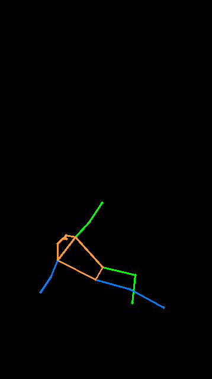
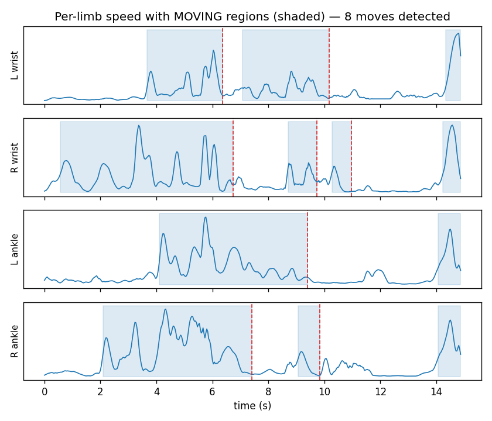
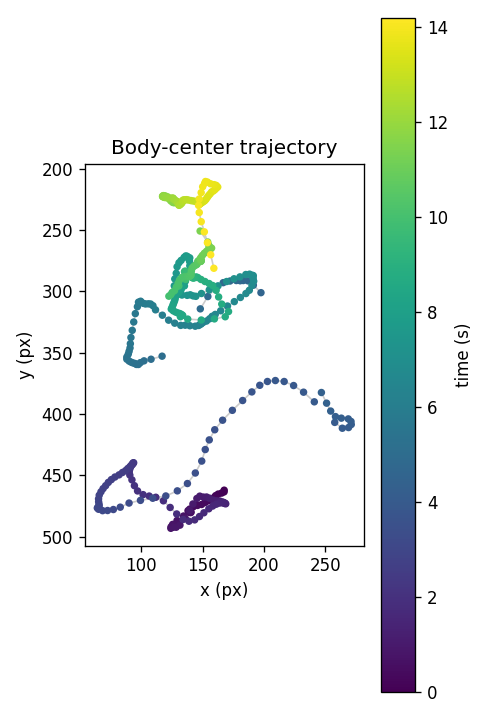

# Climber

A rock climbing analysis tool that tracks climbing metrics from video inputs using Human Pose Estimation (HPE), exposed via an asynchronous FastAPI backend.

Built to propose a base framework for an end-to-end CV pipeline. Any training / finetuning / evaluation is out of scope here, mostly for lack of annotated data (and time).

Extracted metrics:
- Number of moves
- Not-moving time
- Trajectory



## Example output

Running the pipeline on the ~14 s demo clip (`data/test.mp4`, not shipped):

```json
{
  "video_metadata": { "duration_seconds": 14.567, "fps": 30.0 },
  "climbing_metrics": { "move_count": 8, "static_time": 3.7 }
}
```



Per-limb speed (wrists + ankles) after confidence gating, velocity-outlier rejection,
left/right de-swapping and Savitzky-Golay smoothing. Shaded spans are the `MOVING`
state from a hysteresis classifier. Dashed lines mark the end of each move
(`src/analyse.py`). `static_time` is the span where all four limbs are static.



Hip-center path over the climb, coloured by time. All numbers are heuristic and tuned
by eye, see *Notes & limitations* below.

## Tech Stack
* **Language:** Python 3.10+
* **HPE Engine:** [rtmlib](https://github.com/Tau-J/rtmlib) for pose estimation
* **API Framework:** FastAPI + Uvicorn for asynchronous task execution
* **Containerization:** Docker

## Project Structure
```text
climber/
├── demo/                # Test scripts for rtmlib
├── experiments/         # MLflow experiment scripts
├── reports/             # MLflow sweep results (CSV)
├── src/
│   ├── analyse.py       # Compute climbing metrics
│   ├── app.py           # FastAPI entry point & background tasks
│   ├── config.py        # Global configuration settings
│   ├── main.py          # Pipeline runner / CLI entry point
│   ├── mlflow_model.py  # MLflow pyfunc model wrapper
│   ├── pose.py          # HPE and tracking logic
│   └── utils.py         # Helper functions
├── tests/               # Unit tests
```

## Getting Started
### Option A: Run with Docker (Recommended)

Make sure you have Docker installed.
1. Build the Docker image
```bash
docker build -t climber:latest .
```

2. Run the container
```bash
docker run -p 8000:8000 --name climber-app climber:latest
```

### Option B: Local Setup (Development)

1. Clone the repository
```bash
git clone https://github.com/Archjbald/climber.git
cd climber
```

2. Set up a virtual environment
```bash
python -m venv .venv
source .venv/bin/activate  # On Windows use: .venv\Scripts\activate
```

3. Install dependencies
```bash
pip install -r requirements.txt
```

4. Run the API

Start the local development server using:
```bash
uvicorn src.app:app --reload
```

You can also run the pipeline directly on a file:
```bash
python -m src.main path/to/climb.mp4
```

## API Documentation

Once the application is running (via Docker or locally), access the interactive API documentation at:

👉 http://localhost:8000/docs

Flow: `POST /analyze` uploads a video (validated for extension, size and decodability),
returns a `task_id`, and runs the pipeline in the background. Poll `GET /tasks/{task_id}`
for the result.

**Scope:** this is a single-node demo backend, not a production service. Jobs run one at
a time (a new upload is rejected with `409` while another is processing), task state lives
in an in-memory dict (lost on restart), and there is no auth or persistence layer.

## Experiment Tracking (MLflow)

Due to lack of labeled climbing dataset, MLflow is used to track:
- rtmlib backend/mode selection
- tuning the post-processing heuristics (smoothing, velocity filtering)

Tuning decisions are made qualitatively by inspecting logged trajectory
output metrics per run.
- `reports/climbing_backend_sweep.csv`: FPS vs. detection confidence across modes
- `reports/climbing_heuristic_tuning.csv`: smoothing/threshold sweep results

The full pipeline is packaged as a registered MLflow pyfunc model
(`src/mlflow_model.py`) and servable via `mlflow models serve`.

P.S.: experiments require the existence of videos within a `data/` folder, that are not provided in this repo. Please modify the CLIP paths in the `experiments/run_*.py` files.

## Notes & limitations
- No labelled data, so metrics are validated only by eye against the overlay video. The
  demo-clip numbers above look about right, but there is no ground-truth benchmark.
- Pose tracking assumes a single climber in frame.
- Tracking degrades once the climber tops out or leaves the frame.

## License

MIT, see [LICENSE](LICENSE). Built by Romain G. ([@Archjbald](https://github.com/Archjbald)).
